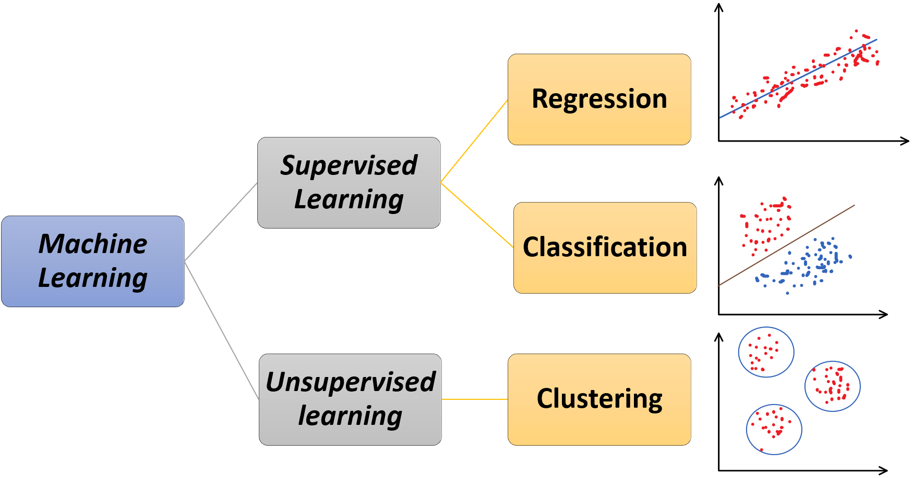

# Machine Learning: Pengenalan Konsep

Tahukah anda bagaimana YouTube dapat memberikan rekomendasi vidio yang mungkin anda suka? atau bagaimana Gmail dapat membedakan email yang spam dan bukan? Kedua contoh tesebut berkerja dengan memanfaatkan algoritma machine learning (pembelajaran mesin). Youtube memanfaatkan algoritma machine learning untuk memberikan rekomendasi berdasarkan vidio yang anda suka, kategori vidio yang anda suka, dan lain sebagainya. Sedangkan Gmail memanfaatkan algoritma machine learning untuk mengklasifikasi email yang spam dan bukan spam. Saat ini mungkin anda bertanya-tanya apa itu machine learning? dan apa membedakan algoritma machine learning dengan algoritma pemrograman konvensional?

## Apa itu machine learning?

Secara umum machine learning merupakan suatu algoritma yang membuat mesin mampu belajar dan memahami pola dari data. Pada algoritma pemrograman konvensional untuk mengerjakan sebuah tugas umunya kita membutuhkan intruksi perintah yang lengkap untuk menghasilkan keluaran yang diinginkan dengan menggunakan sebuah input tertentu. Sedangkan algoritma machine learning memungkinkan mesin untuk membuat sebuah aturan (rules) berdasarkan data sampel (berisi input dan target keluaran) yang diberikan, selanjutnya aturan tersebut akan digunakan untuk mengerjakan sebuah tugas tertentu. Perbedaan ini yang membuat machine learning disebut sebagai “a new programming paradigm”.

Perbedaan tersebut juga yang membuat algoritma machine learning mampu mengerjakan persoalan yang sulit atau hampir mustahil apabila dikerjakan dengan menggunkaan algoritma pemrograman konvensional. Sebagai contoh sistem pendeteksi objek hampir mustahil dibuat dengan menggunkan algoritma pemrograman konvensional karena dibutuhkan banyak sekali instruksi untuk membedakan satu objek dengan objek lainnya. Sedangkan dengan menggunkaan algoritma machine learning kita hanya perlu sekumpulan sample data dari tiap objek, lalu mesin akan membuat aturannya sendiri untuk membedakan tiap objek.

Sebelum membahas machine learning lebih dalam, terdapat beberapa istilah dasar yang berkaitan dengan machine learning. Istilah yang pertama adalah model, model merupakan representasi statistik dari sistem machine learning untuk melakukan prediksi. Istilah yang kedua adalah feature dan label, sederhananya feature dapat dipahami sebagai input variabel yang digunakan untuk melakukan prediksi dan terdapat pada data sampel, sedangkan label dapat dipahami sebagai jawaban dari prediksi atau keluaran yang diharapkan yang terdapat pada data sampel. Istilah selanjutnya adalah dataset, dataset merupakan sekumpulan data yang mengandung feature dan terkadang mengandung label. Selain itu, secara umum terdapat dua buah tipe machine learning yang sering digunakan yaitu supervised learning dan unsupervised learning.

## Supervised Learning

Supervised learning merupakan tipe machine learning yang mana model mempelajari pola dari dataset yang telah memiliki label. Berdasarkan definisi tersebut dapat disimpulkan bahwa tujuan dari supervised learning adalah untuk mencari pola hubungan antara feature dan label yang terdapat pada dataset. Supervised learning biasanya digunkaan untuk menyelesaikan beberapa permasalahan populer seperti membuat model untuk memprediksi suatu nilai kontinu (regression) dan membuat model untuk memprediksi suatu nilai diskrit (classification).

Regression umumnya digunakan untuk membuat prediksi dengan keluaran berupa angka. Pada kasus ini algoritma machine learning digunakan untuk membuat membuat aturan yang mampu menjelaskan korelasi liner maupun nonlinear dari data feature dan label. Sedangkan classification umumnya digunkaan untuk mengelompokkan data yang memiliki kesamaan berdasarkan label yang telah diberikan. Pada kasus ini, algoritma machine learning digunakan untuk membuat aturan untuk mengelompokkan data yang memiliki kesamaan tersebut.

## Unsupervised Learning

Unsupervised learning merupakan tipe machine learning yang mana model mempelajari pola dari dataset yang hanya memiliki feature. Walaupun dataset yang digunakan tidak memiliki label, kita masih tetap bisa melihat pola yang menarik dari data. Unsupervised learning digunakan untuk menyelseaikan beberapa permasalahan yang berkaitan dengan data tanpa label, salah satunya adalah membuat model untuk mengelompokkan data (clustering) berdasarkan kemiripan.

Clustering digunkaan untuk mengelompokkan data yang memiliki kesamaan kedalam suatu klaster, yang mana tiap klaster memiliki karakteristik yang berbeda. Karena data yang digunakan tidak memiliki label kita bisa secara bebas menentukan jumlah klaster yang akan dibuat, namun perlu diingat bahwa jumlah klaster akan mempengaruhi performa model. Pada praktiknya terdapat bebrapa pendekatan yang dapat digunakan untuk memilih jumlah klaster yang paling optimal.

## Langkah-Langkah Membuat Model Machine Learning

Umumnya terdapat enam tahapan dalam pembuatan model machine learning, yaitu:

- Memahami permasalahan, pada tahap ini kita perlu memahami terlebih dahulu permasalhan apa yang akan kita selesaikan dan membuat problem statement.
- Mengeksplorasi dan meproses data, pada tahap ini kita perlu mengeksplorasi data yang kita miliki sehingga kita tahu data mana yang kita butuhkan untuk menyelesaikan permasalahan tersebut. Pada tahap ini juga terkadang kita membagi dataset mejadi dua bagian yaitu data training dan data testing.
- Membuat model, pada tahap ini barulah kita menentukan model machine learning apa yang akan kita gunakan untuk menyelesaikan problem tersebut.
- Melatih (training) model, pada tahap ini kita melatih model yang telah kita buat dengan menggunkan data training.
- Evaluasi (testing) model, pada tahap ini kita menguji model telah kita latih dengan menggunakan data testing.
- Meningkatkan model, pada tahap ini dilakukan perbaikan model berdasarkan hasil evaluasi. Apabila hasil yang diperoleh dari model belum menjawab problem statement atau dianggap kurang baik, maka kita perlu mengulai semua proses untuk meningkatkan performa model yang dibuat.

## Refrensi

Müller, Andreas C & Sarah Guido. Introduction to Machine Learning with Python. O’Reilly Media

Putra, Jan Wira Gotama. Pengenalan Konsep Pembelajaran Mesin dan Deep Learning